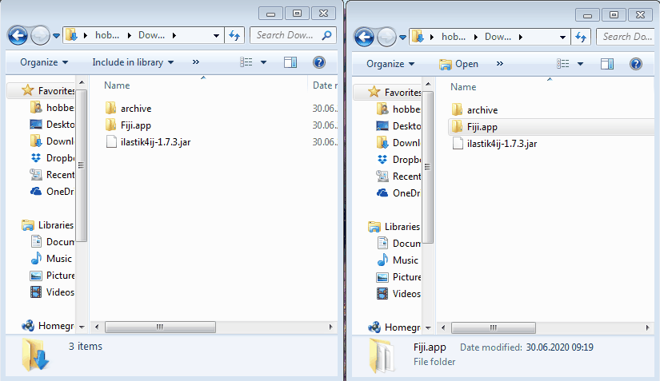
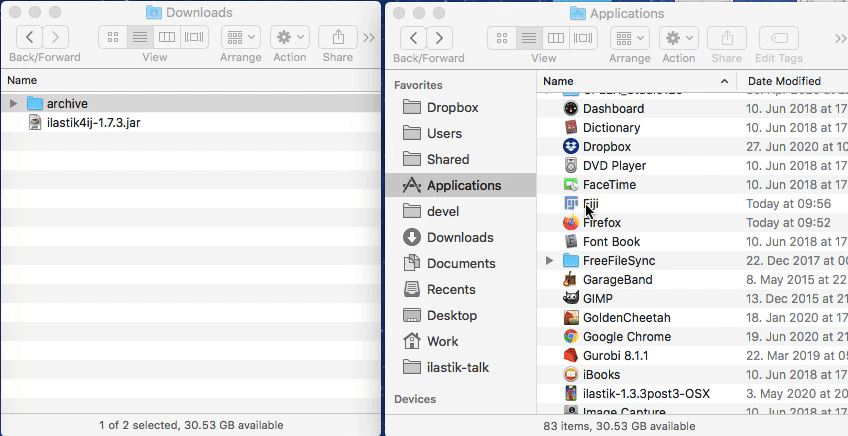

# Manual ilastik-fiji plugin installation

30. June 2020: The Fiji update site is currently not functional.

This is a quick summary on how to install the ilastik fiji plugin manually.

## 1. Download the plugin

We have hosted the latest version of the plugin on our download site:
[https://files.ilastik.org/ilastik4ij-1.7.3.jar](https://files.ilastik.org/ilastik4ij-1.7.3.jar) (right click, save).

## 2. Install 

### Preferred method:

drag and drop the `ilastik4ij-1.7.3.jar` onto your imagej gui and you're done.

if you prefer more involved ways:

### Copy the plugin to the Fiji plugin folder (not needed if the above worked)

This is specific to the operating system

### Windows

Find your `Fiji.app` folder (I have extracted it in my `Downloads` folder).
Copy the `ilastik4ij-1.7.3.jar` to `Fiji.app\plugins`:

** Make sure there is not an older version of `ilastik4ij` in that folder. If so, delete it! **

### Mac OSX

On OSX, use Finder to navigate to your `Fiji.app`.
This can be typically found in `Applications`.
Ctrl-click on it and select _Show Package Contents_.
Copy the `ilastik4ij-1.7.3.jar` to the plugins folder you can see there:

** Make sure there is not an older version of `ilastik4ij` in that folder. If so, delete it! **

### Linux

Locate your Fiji folder and copy the `ilastik4ij-1.7.3.jar` to `Fiji.app/plugins`.

** Make sure there is not an older version of `ilastik4ij` in that folder. If so, delete it! **
